

# Project 2 - VSCode Software Architecture Analysis

## Emily Choi, Tiffany Chung, Elizabeth Gronski, Cindy Yang

## Context and Background

VSCode is a source-code editor that enables users to write and edit code. VSCode has many features that make it unique to other resources for code writing: including debugging code within the text editor, built-in git commands that allow you to run within the application, and installation of customizations (apps, themes, etc.). It is common in workplaces and education, including UW classes, to write Python scripts, Java, and Javascript for class projects. This versatile editor has become a go-to tool for coders of all levels, from beginners to seasoned professionals.

VSCode is a Microsoft Corporation product that was launched in 2015. Microsoft is the creator and current maintainer. According to the VSCode GitHub repository, Microsoft writes "This repository ("Code - OSS") is where we (Microsoft) develop the Visual Studio Code product together with the community." The changes are approved by Microsoft but many contribute to it.

Here are the links to access additional information about the system:
- [VS Code GitHub repository](https://github.com/microsoft/vscode/tree/main)
- [VS Code Official Website](https://code.visualstudio.com/)
- [VS Code Documentation](https://code.visualstudio.com/docs)

## Development View
### Key Components and their Dependencies
Here we present a table that outlines the key components and their dependencies of the system that make up VS Code. All these components listed work together to be versatile and extensible, allowing VS Code to provide the user a customizable development environment. Supporting the user interface, server-side development, external system, and the underlying platform, these components have substantial roles that are necessary for the functionalities within the system to use and process data with minimal trouble and frame the system’s architecture.
| Components          | Purpose                         | Dependencies        |
| :---                | :----                           | :---               |
| Code Editor         | The primary workspace for writing, editing, and managing the user’s code. It supports various programming languages and file types, while also providing features like syntax highlighting, IntelliSense, code navigation, and so on.| Chromium Engine, Electron |
| Debug               | The debugger involves features such as breakpoints, variable inspection, and call stack tracking, all of which support various programming languages. | Chromium Engine, Node.js |
| Terminal            | VS Code includes an integrated terminal that allows users to run command-line tasks directly with the code editor. | Chromium Engine, Electron, Node.js |
| Source Control View | A sidebar of VS Code that displays changes to the user’s code and allows them to interact with Git repositories. It provides an interface for staging changes, committing, pulling, pushing, and viewing commit history. | Chromium Engine, Electron |
| Search              | Provides global search and replace across the user’s open folder. | Chromium Engine, Electron |
| Node.js             | A JavaScript runtime that allows server-side execution of JavaScript code. | External Libraries |
| Electron | Allows VS Code to run on multiple different desktops (Windows, macOS, Linux) | Node.js, Chromium Engine |
| Chromium Engine     | Responsible for displaying the various UI elements within the VS Code desktop application. | None |
| Extensions          | VS Code allows extensions in order to enhance its functionality, such as Python, C++, GitHub Copilot, and many more. | Electron, Node.js |
| User Interface      | Provides access to the user of the different features and information. | Chromium Engine |

### UML Component Diagram
Below is a visual diagram of the identified system components that represents VS Code’s organization:

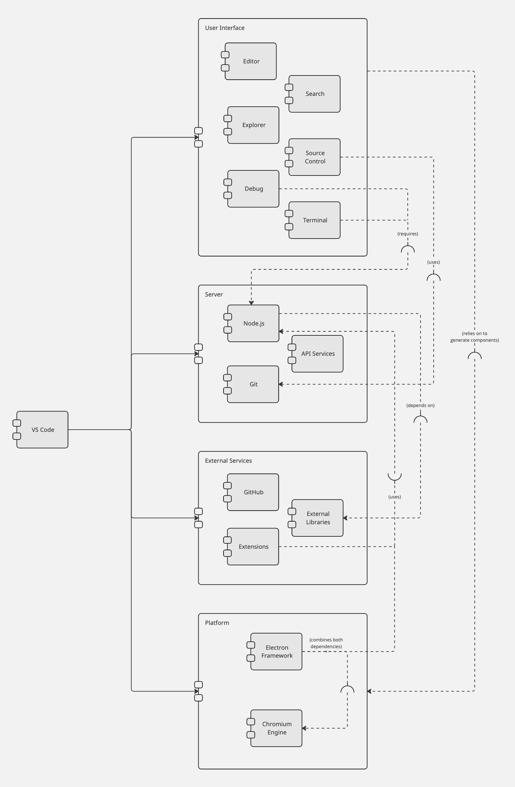

*Figure 1: UML Component Diagram. The visualization of the system's architecture and organization through the key components and their relationship with other components.*

### Source Code Structure
Many of VS Code’s source code structure is located in its “[vs](https://github.com/microsoft/vscode/tree/main/src/vs)” folder within the src folder of the  main repository. There are a couple of folders that reside in the vs folder: [base](https://github.com/microsoft/vscode/tree/main/src/vs/base), [code](https://github.com/microsoft/vscode/tree/main/src/vs/code), [editor](https://github.com/microsoft/vscode/tree/main/src/vs/editor), [platform](https://github.com/microsoft/vscode/tree/main/src/vs/platform), [server](https://github.com/microsoft/vscode/tree/main/src/vs/server), and [workbench](https://github.com/microsoft/vscode/tree/main/src/vs/workbench). Each of these folders contain some form of the components described above, such as code containing Electron, server containing Node.js, and platform containing the terminal, extensions, code editor, and many other integrated plug-ins. As a whole, the system’s high-level codeline model is designed to provide a structured and maintainable foundation for expanding the code editor by incorporating collaborative features, cross-platform compatibility, and an ecosystem for extensions within VS Code.

### Testing and Configuration
The way VS Code is running its tests is located within the “[test](https://github.com/microsoft/vscode/tree/main/test)” folder, and leverages automated testing to ensure the reliability and stability of the codebase. They described three ways they perform automated tests:

**[Unit Tests](https://github.com/microsoft/vscode/tree/main/test/unit)**: VS Code provides a suite of unit tests that evaluates individual components and functions. By isolating each component, developers can focus on specific functionalities of code without being affected by the complexity of the entire system. These tests can be run either inside Electron, or within the browser itself.
In an Electron renderer environment, unit tests access the DOM and Node.js API in order to run all tests from the file specified in the script and debug them. The script’s format is as follows:

`./scripts/test.sh --debug --glob /{file}.test.js`

Inside their browser, users must run this script to perform the tests:

`yarn test-browser --browser webkit --browser chromium`

**[Integration Tests](https://github.com/microsoft/vscode/tree/main/test/integration)**: These tests include a string of API tests that assess the interactions and compatibility of multiple components within VS Code’s codebase. This includes real-world scenarios to validate the behavior of the code within the entire system. Similarly to unit tests, integration tests can be run either through Electron or from the browser.
 In order for these tests to run, users must run these commands to compile and install the dependencies:

`yarn --cwd test/integration/browser`

`yarn --cwd test/integration/browser compile`

To run inside Electron, the following script must be compiled:

`scripts/test-integration.[sh|bat]`

To run within the user’s browser, they must compile this following script:

`scripts/test-web-integration.[sh|bat] --browser [chromium|webkit] [--debug]`

**[UI Tests (smoke)](https://github.com/microsoft/vscode/tree/main/test/smoke/src)**: Named as “smoke” within VS Code’s codebase, its UI tests evaluate the functionality of VS Code as a whole, including user interactions and workflows, ensuring that the functions work as intended for the user. This involves automations of user interactions to verify features and functionality instances of VS Code.

For the VS Code Smoke test, users must ensure that they are on Node v12.x. For an overview on scripts users must build to perform the tests, users may follow the instructions within the [smoke README file](https://github.com/microsoft/vscode/tree/main/test/smoke) that gives a step-by-step guidance of getting the latest version release and the necessary steps for testing.

## Applied Perspective
In the context of the accessibility perspective for Visual Studio Code, the focus is ensuring that software is usable and accessible to individuals with disabilities. This perspective takes into account the design and implementation of features that facilitate interaction and navigation for users with disabilities, such as visual or motor impairments. The aim is to provide features and designs accommodating to a diverse user-base through providing a strong support for interfaces like screen readers.

Here are some key accessibility features and functionalities in VS Code:
- Keyboard Navigation: Move around and control the software using special keys instead of a mouse. This helps those who find using a mouse difficult
- Screen Reader Support:  Changes what's on the screen into spoken words, making it user-friendly for people with visual impairments
- High Contrast Themes: Alters the appearance to offer clearer visuals, assisting those with color blindness or low vision in distinguishing elements
- Zoom Functionality: Enlarges text and elements, aiding users with visual impairments or difficulty in seeing smaller detail
- Customizable Color Themes: Lets users modify how things look, such as changing colors, to improve readability and adapt to different preferences and need

Primary concerns when considering the Accessibility perspective in Visual Studio Code include:

**1. Types of Disability: How accessible is Visual Studio Code for people with disabilities?**

It is crucial to understand and recognize different types of disabilities such as visual or motor impairments that affect how users react to the VS Code.

Motor Impairments
Problem: Individuals with motor impairments can benefit from customizable keyboard shortcuts.  Individuals with severe motor impairments, like complete paralysis, might face challenges in traditional code input methods. There are some motor impairments that can affect different parts of the body, including hands, feet, and even mouth. For instance, users with hand impairments may find it difficult to use a standard keyboard or mouse.
Visual Impairments
Problem: Users who are blind or have low vision might struggle with standard visual interfaces. The low contrast in most themes can make it difficult to decipher text,  buttons, and text fonts.  This can be problematic for users who depend on clear and distinct fonts for understanding the code.
Color Blindness
Problem: Seeing color is another challenge for disabilities. Some people have trouble telling certain colors apart due to color vision issues.  It is especially relevant since VS Code syntax is often highlighted using different colors.
Deafness
Problem: People who are deaf cannot respond to audio cues that software might implement, such as error or breakpoint notifications
Low Literacy
Problem: Individuals with low literacy levels may face challenges in understanding written content.  This is especially relevant given that code is predominantly text-based, and menus within the VS code interface are also presented in written form.

**2. Functional Availability: Even if Visual Studio Code provides solutions, are they good and helpful?**

- Functional availability means not just having accessibility features, but making sure they really work well.  For example, having keyboard navigation is valuable, but it's equally important that it's intuitive and comprehensive.  Users, especially those with disabilities, should be able to navigate with the software seamlessly.
- It's crucial that the accessibility features, including the ability to heavily customize themes and colors for syntax highlighting, are thoroughly tested. Real-world scenarios should be included in testing to identify any gaps or shortcomings in these features
- The code should ideally be tried and tested with candidates with disabilities. The testing should include real-world scenarios to identify any gaps or shortcomings in the accessibility features.
- Programmers adding accessibility features may not understand  the challenges faced by users with disabilities. This lack of personal experience can lead to unintentional oversights in the design and implementation of the features.

Extensions for Enhanced Accessibility:
- Users can download extensions on Visual Studio Code that provide additional accessibility features, such as more theme options for the visually impaired, file icons for those with low literacy, and snippets that act as shortcuts for creating functions and other code elements. These snippets can be helpful for individuals with motor impairments, allowing them to type a short string of characters instead of writing an entire code structure.
- It is worth noting that having to find and install these extensions requires a bit of a barrier to entry, as users need to know how to look for them in the extension store (and know that the extension store exists and how to use it). So, there is some nuance in the accessibility process as well.

**3. Disability Regulation: Does Visual Studio Code meet accessibility regulation?**
- Microsoft Programmers that are considering disability regulations may follow established standards like the Web Content Accessibility Guidelines (WCAG). We can assess the adherence to these standards by manually comparing VS Code to each part of the standard.
- Adhering to these accessibility standards is following in the footsteps of past experience in providing accessibility. This would help Visual Studio Code to be  designed and developed with these needs in mind.

To make Visual Studio Code more accessible, we can consider specific solutions for different disabilities:

Motor Impairments
- VS Code features a plugin system where users can add custom features, including accessibility plugins designed to address some of these problems. If someone needs a specific tool to make it work better for them, they might find or create a plugin that adds that tool. For example, the Keymap Extensions allow users to customize keyboard shortcuts to suit their personal preferences - a motor impaired user could use such extensions to remap common keyboard shortcuts to combinations more suitable for their own capabilities.

Visual Impairments
- Features like "Screen Reader Support" in VS code are essential, as they convert on-screen text into spoken words, allowing users to navigate the content better. This way, users can listen to the code and navigate through it without needing to see it. It's a crucial tool that makes coding accessible to everyone, regardless of their ability to see the screen.

Color Blindness
- "High Contrast Themes" in VS Code can offer different color schemes that keep things clear and distinguishable, making sure everyone can understand the information no matter their ability to see colors. These themes offer different color combinations that work well, ensuring that important information in the code remains clear and understandable, no matter if someone can see all colors or not. It's like adjusting the code's appearance to make sure everyone can follow along, regardless of their ability to see certain colors.

Deaf Solution
- Many audio cues are also accompanied by a status message in the status bar at the bottom of the main screen - between those messages and any settings and/or extensions to emphasize changes in those messages. Deaf users would be able to take note of most if not all of the status changes that hearing users would notice via an audio cue.

Low Literacy
- The screen reader in VS Code plays a crucial role in supporting users with low literacy. In VS Code, when the user moves their mouse over a keyword or function name, it pops up a description from the documentation. While an illiterate person may struggle to read and comprehend it, the screen reader provides an alternative, enabling better understanding.

### Activity 1: Evaluating Keyboard Usability for Accessibility

Purpose: Assess Visual Studio Code's keyboard navigation functionalities to ensure that customers who depend on keyboard-only interaction may use them.

#### Steps
1. Open Visual Studio Code
2. Use only the keyboard to navigate the interface; do not use a mouse
3. Test routine operations like launching files (using keyboard shortcut Ctrl+O or Command+O), switching between tabs, and accessing settings
4. Take note of how user-friendly and effective keyboard navigation is
5. Note any difficulties encountered and places where the navigation could be made better

#### Results

Positives:
- There are well-documented keyboard shortcuts accessible for frequently used tasks
- A complete set of keyboard-accessible commands is available via the Command Palette (⇧⌘P)
- A wide range of debugging features that make it easier for users to use, such as an adaptable and integrated terminal and debug console

Concerns:
- Users who rely on keyboard navigation may be impacted by certain UI elements' unclear attention indicators
- It may take more than one step to access some functions using keyboard-only interaction
-Taking into account continuous user feedback and testing for various accessibility requirements
- Features of the debug console and terminal are accessible to users with motor or visual impairments
- Make sure that the accessibility features in all the various software sections are consistent so that the user experience is seamless

### Activity 2: Setting Up a High Contrast Theme for Vision Impairments

Purpose: The goal is to set up and evaluate Visual Studio Code's High Contrast theme so that users with vision impairments can see things more clearly.

#### Steps
1. Open Visual Studio Code
2. Use ⌘, (macOS) or Ctrl +, (Windows/Linux) to access the settings
3. Open "Color Theme" settings by navigating to Code > Preferences > Color Theme (⌘K ⌘T)
4. Choose the theme "High Contrast"
5. Keep an eye out for visual modifications and how readable the code and UI components are
6. To make sure visibility is consistent, test various code files and UI elements

#### Results
Positives:
- The High Contrast theme makes code and UI elements more readable by greatly enhancing text visibility
- For those with color vision impairments, icons and syntax highlighting are still discernible
- A consistent, high-contrast experience is ensured by the theme's maintenance of consistency throughout the interface.
- For different programming languages and file types, readability is maintained

Concerns:
- The High Contrast theme improves readability, but users and developers should be aware that it may have unintended consequences, like headaches or eye strain, especially when used for extended periods of time
- Check the theme's touch point architecture to ensure that touch interfaces or other alternative input methods can be easily navigated and interacted with by users
- Assess the accessibility of the system as a whole, taking screen reader and other assistive technology compatibility into account
- Use ongoing user feedback to improve the theme's architecture and take into account any new accessibility requirements that users may have found

## Identify Styles & Patterns Used

### Architectural Style

VSCode follows a combination of most of the model-view-controller (MVC) architectural style and the event-driven architecture. VSCode heavily relies on an event-driven architecture, leveraging asynchronous communication and event handling to manage various interactions within the editor. For example, when a file is opened or modified, events are dispatched and handled by relevant components responsible for updating the UI. Events like clicks, keystrokes, mouse movements, and commands trigger actions within the editor. These events are captured and processed asynchronously, allowing for smooth and responsive user interactions.

The model aspect can be associated with the core editor logic, including the representation and management of text, documents, language services, and the overall state of the editor. The view corresponds to the UI components responsible for displaying the editor, panels, sidebars, and various visual elements where users interact with the editor. For the controller, the lines are blurred as it employs a more event-driven architecture. There isn’t a distinct controller layer but instead, interactions are often managed through event handlers and triggers, facilitating actions and updates in the model or view based on user input or system events.

### Design Patterns
#### Adapter Pattern
The Adapter Pattern enables integration and interaction between various components, especially when dealing with external interfaces or systems that have different interfaces incompatible with the editor's internal structure. In the [terminalLinkDetectorAdapter.ts
](https://github.com/microsoft/vscode/blob/main/src/vs/workbench/contrib/terminalContrib/links/browser/terminalLinkDetectorAdapter.ts) file, the `TerminalLinkDetectorAdapter` acts as an intermediary or mediator, translating and enabling communication between the xterm.js terminal, designed with the `ILinkProvider` interface, and the `ITerminalLinkDetector`, which effectively bridges the interface differences through adaptation. By adapting the `ITerminalLinkDetector` to the `ILinkProvider`, the adapter abstracts the actual link detection process and its implementation details from the xterm.js terminal. This abstraction shields the terminal from the specifics of the link detection logic, allowing it to only focus on the link information in a compatible format.

#### Decorator Pattern
The Decorator pattern is a structural pattern that can be used to dynamically add responsibilities without directly altering the core components. This enables users and extension developers to customize and enhance the editor's capabilities according to their specific needs with decorations like borders and shadows on components, or enhance the UI with scrolling and zooming features. This would involve wrapping an object within another object to add new behaviors or functionalities at runtime. The `createDecorator` function is a factory for generating decorators found in [decorators.ts](https://github.com/microsoft/vscode/blob/main/src/vs/base/common/decorators.ts). The functions `memoize`, `debounce`, and `throttle` are all decorators themselves. They take in a target function, enhance its behavior with additional functionality (caching, delaying execution, or limiting execution rate) by dynamically modifying the behavior, and then return a new function that wraps the original one.

#### Observer Pattern
The Observer Pattern facilitates communication and event handling between different components, enabling a reactive and event-driven design. By subscribing to relevant events, extensions in VSCode can customize behavior, add features, or integrate new functionalities, enhancing the editor's capabilities. Additionally, VSCode employs a system where various components can subscribe to and listen for specific events or changes. When an event occurs (such as a file change, a user action, or an extension activation), subscribers or observers are notified. For instance, in this [activity.ts](https://github.com/microsoft/vscode/blob/main/src/vs/workbench/contrib/scm/browser/activity.ts) component, it listens to events like `onDidAddRepository`, `onDidChange`, and `onDidChangeConfiguration` from various services (ISCMService, IConfigurationService, etc.). These functions act as observers that react to changes triggered by the events.

#### Factory Pattern
The Factory Pattern provides an interface for creating objects but allows subclasses to alter the type of objects that will be created. This pattern promotes loose coupling by allowing the creation of objects without specifying the exact class of object that will be created. This is particularly useful in the extension API where various types of objects need to be created based on user interactions.
The [nodeSocketFactory.ts](https://github.com/microsoft/vscode/blob/main/src/vs/platform/remote/node/nodeSocketFactory.ts) object serves as a factory method for creating `ISocket` instances specifically for WebSocket connections. It encapsulates the logic for creating instances of `ISocket` and provides a `connect` method that creates specific types of socket instances. The method handles the creation process independently, separating the object creation logic from the client code that utilizes the created objects.

## Architectural Assessment

### Dependency Inversion Principle

>“Depend on abstractions, not on concrete classes”

The Dependency Inversion Principle explains how to implement high level modules that do not depend on low level modules, but rather how they can both depend on abstractions. To utilize this principle, the software will have abstractions that utilize processes that can be easily reused. The low level modules depend on the abstraction, but the abstractions do not depend on the details of the low level module. For example, rather than having a button module turn a lamp module off and on, you can add an abstraction that toggles between off and on. The logic of turning off and on can then be applied to the button on the lamp. Then this abstraction can be reused to turn on and off the TV, or a hair dryer.

VSCode has numerous abstract classes and interfaces that are utilized and reused to create more concrete classes and interfaces. They have successfully implemented the Dependency Inversion Principle throughout their modules by having concrete classes derive from abstract classes. In the examples you will see this principle played out for functionality such as opening and scrolling.

**Example 1**

There are multiple scrollbars used by VSCode. There are concrete scroll bar classes, including: `verticalScrollbar` and `horizontalScrollbar`. Each one of these inherits the `AbstractScrollbar` class. Then, their own details are added to make the class concrete. This eliminates the need to override functionality. These concrete classes are not derived from other concrete classes, but the abstract class `AbstractScrollbar`.

**Code**

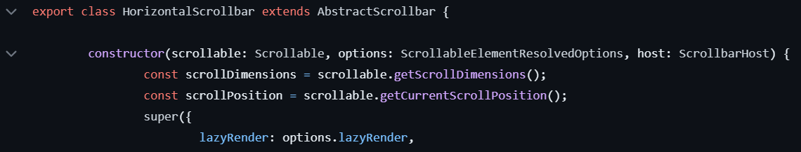

*Figure 2: The HorizontalScrollBar concrete class extending the abstract class AbstractScrollbar*

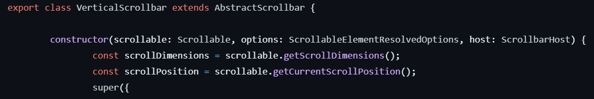

*Figure 3: The VerticalScrollBar concrete class extending the abstract class AbstractScrollbar*

**Example 2**

There is a need to open objects throughout VSCode, whether that be opening a URL, a command, or the editor. VSCode has utilized an abstract opener interface `IOpener` that it utilized in different places to perform a simple function of opening the item requested. The concrete classes ‘CommandOpener`, `EditorOpener`, and `BrowserURLOpener` all implement the IOpener interface and use the functionality on their specific platform (command, editor or browser url). Rather than deriving from a concrete class, they have derived from an abstract interface that performs a simple open function. Then, each of these new concrete classes have added their own details to differentiate what the Opener interface is opening.

**Code**

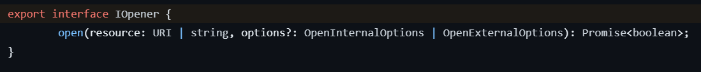

*Figure 4: The IOpener Interface being defined*

*Figure 5: The BrowserURLOpener concrete class implementing IOpener interface*

****

### Open-Closed Principle

>"Elements should be open for extension but closed for modification"

The Open-Closed Principle explains modules, classes, functions should be open for extension, but closed for modification. This essentially means that any of these software objects are complete, finished and should be treated as such. However, they are able to be inherited, and become the parent of a new module, class, function. By adding new features to the child and leaving the original software object alone, you have extended it without modifying it. For example, say you have several classes of superheroes. They all have similar capabilities, but also unique ones. If you want to add a new superhero, you could take a `hero` interface and extend it to create `Iron Man` or `Captain America`. You can then add their unique capabilities while already having the shared ones inherited from the `hero` interface.

VSCode has several instances of the Open-Closed Principle. It is easily noticeable in their process of adopting similar logic and adding more unique detail to create subclasses of objects. In many instances they have these broader classes, but they are not modified to add new capabilities, rather extended.

**Example 1**

There are multiple scrollbars used by VSCode. There is a need to have a horizontal scrollbar to look through long lines of code in the editor. There is also a need to have a vertical scroll bar to go up and down code with many lines. These would have the same functionality (scrolling) but would need added modifications that allow the user to change the direction of their scrolling. VSCode has instead extended the class that creates the scrollbar and has created new classes that create scrollbars for each direction on the page. The scrollbar code remains unchanged, but has been extended to create new capabilities.

**Code**

*Figure 6: The HorizontalScrollBar class extending the class AbstractScrollbar*

*Figure 7: The VerticalScrollBar class extending the class AbstractScrollbar*

**Example 2**

Within the User Interface of VSCode, there are multiple “bars” of various items. There is the activity bar which shows “view” that the user can use, including the file explorer, the debugger, etc. There is also a menu bar which is very common in most applications. That is where you see common items such as File, View, Tools, etc. In VSCode, the activity bar (described as `ActionBar` within the code) and menu bar have very similar functionality. Activity Bar was already created when Menu was being made, and in line with the Open-Closed Principle the Activity Bar was not modified to accommodate for the modifications needed to create the Menu Bar. The Menu Bar took the capabilities of the Activity Bar and extended them to accommodate the differences. For example, a menu bar also has a `submenu` which is a new list of objects that appears when an item in the menu is selected. This was not a feature of the Activity Bar, and it didn’t need to be because this was a unique feature of the `Menu`.

**Code**

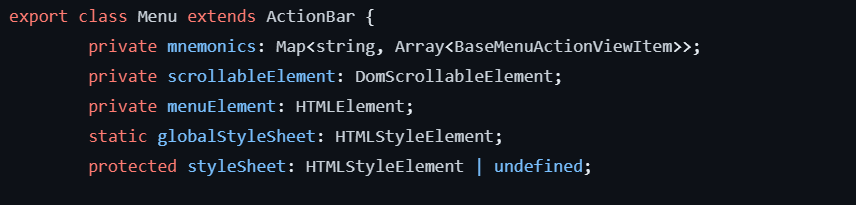

*Figure 8: The Menu class extending the ActionBar class*

 and Menu Bar look like on the user interface")

*Figure 9: Diagram of what the Activity Bar (Action Bar) and Menu Bar look like on the user interface*

****

### Favor Composition over Inheritance

>“Classes should achieve polymorphic behavior and code reuse by their composition rather than inheritance from a base or parent class.”

The Favor Composition Over Inheritance Principle explains that it is more efficient and flexible to use composition rather than inheritance. Put simply, code will be easier to modify and update if your software entities are composed of multiple objects rather than inheriting functionality from one parent. This principle boils down to the relationship between the original object and the new object you are trying to create. Favor Composition Over Inheritance states you should only use inheritance when the new object “is a” original object. For example, a dog is an animal, and a square is a rectangle. Otherwise, you should use composition for code reuse. Composition utilizes a “has a” relationship. For example, a rectangle has four sides and has 90° angles. Another example, a car has an engine, wheels, and a steering wheel. For this principle, we would reuse the code of class `engine`, `wheel`, and `steering wheel` by combining these into class `car`.

VSCode successfully implements this principle. The structure of VSCode requires lots of compositions to get their main components of their user interface. Rather than inheriting functionality, they utilize this design principle by composing complex classes from smaller/simpler classes.

**Example 1**

One main component of VSCode’s user interface is the toolbar, which is located at the far left of the screen. Here users are able to switch between views in the sidebar, and interact with those views. For example one of those is the file explorer where they can go between files in their repository. VSCode created a hierarchical composition which gives us our final project. At a high level, the toolbar is composed of many objects, including the activity bar. This bar is composed of different action view items. These components do not inherit functionality from one other, but are rather composed of the simplest classes. Each is imported and then added into the larger classes. This keeps the functionality with the smallest item, and allows for more flexibility within the toolbar, and its components.

**Code**

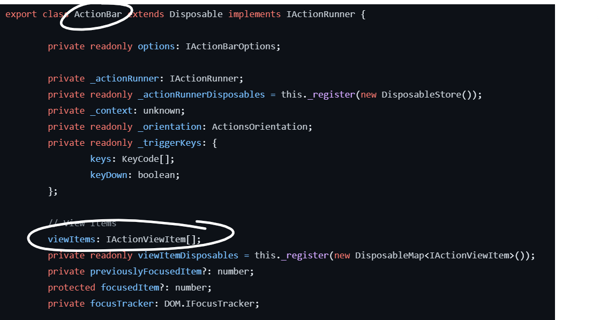

*Figure 10: ActionBar is made up of view items*

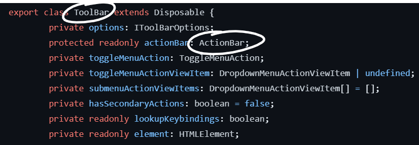

*Figure 11: Toolbar is composed of ActionBar, along with other items*

 looks like when displayed on user interface")

*Figure 12: Diagram showing what the Activity Bar (Action Bar) looks like when displayed on user interface*

**Example 2**

Similar to the Activity Bar, another main component of the VSCode user interface is the Menu Bar which allows users to navigate between important functions. For example, one of the items in the Menu bar is the File item. This provides options to the user to create a new file, save a file, open a file, etc. This Menu Bar is composed of many different objects, and like the Activity Bar none of the functionality is inherited. All the smaller components are composed into the largest component, Menu Bar. The Menu Bar is composed of the `Menu`, within the Menu are the `BaseMenuActionViewItem` (‘File’, ‘Edit’, ‘View’, etc.), and within each Menu Item are submenus of `SubmenuMenuActionViewItem`! It satisfies the design principle because nothing is inherited, and everything is composed.

**Code**

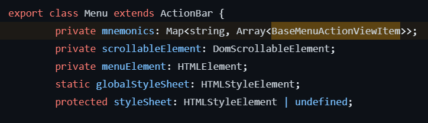

*Figure 13: Showing that Menu is composed of an array of BaseMenuActionViewItems*

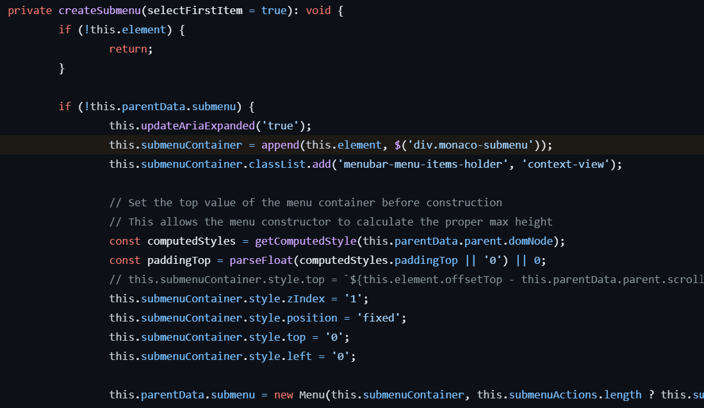

*Figure 14: Showing that Submenu is just a new instance of Menu, but is contained in submenuContainer*

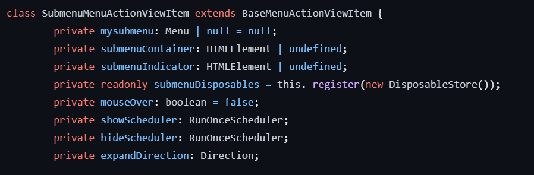

*Figure 15: Showing the creation of SubmenuMenuActionViewItems which compose the Submenu*

****

### Program to interfaces, not implementation

>"Write classes based on an interface."

The Program to interfaces, not implementations principle defines a practice of creating interfaces with the desired behavior of your object, and then creating the object by implementing that interface. The process is more timely than just creating a class and adding the behavior and capabilities to it, but it provides great flexibility and maintainability within your project. With a general interface, you can use that interface to different, more complex objects that start with the same behavior. If you have an interface for wheels for a car, your car can always use an object that implements the wheel interface. That can be simple wheels, or super fancy decked-out wheels. This also lets you update the wheel interface and change the functionality of all wheels that use it without going to each individual wheel and applying those changes separately.

VSCode is a great example of this principle in practice. In almost every UI element within their system, each class is based on an already existing interface. Just like the example mentioned above, this allows the interfaces to be used throughout the system and customized to the varying objects that use them. This can be seen with simple functions such as opening files and URLs within VSCode or by their practice of curating interfaces for a class.

**Example 1**

In earlier examples, the `IOpener` interface was discussed. This interface has a simple functionality of opening objects within the VSCode system. This interface is then used to implement the `BrowserURLOpener` class. This opening capability could’ve been given straight to the `BrowserURLOpener`, but rather the programmers took that extra step to make that function its own interface that can be implemented by many objects. IOpener is used by many objects in VSCode, another being opening the editor where the user can edit files.

**Code**

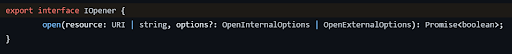

*Figure 16: Showing the IOpener interface*

*Figure 17: Showing the IOpener interface being implemented by BrowserURLOpener*

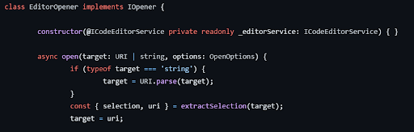

*Figure 18: Showing the IOpener interface being implemented by EditorOpener*

**Example 2**

In a different example, the VSCode team curated a `IEditorWorkerService` interface which is specifically curated for the class `EditorWorkerService`. This interface is less for simple functionality and versatility but demonstrates another benefit of using the Program to interfaces, not implementations principle, which is testing before implementation. By creating the testing for the functionality within the interface, you can essentially create mock objects and then later develop the code. You can see this done with the `EditorWorkerService` object.

**Code**

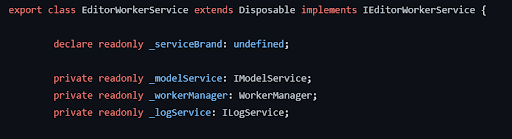

*Figure 19: Showing the IEditorWorkerService interface*

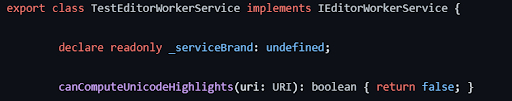

*Figure 20: Showing the IEditorWorkerService interface being implemented by EditorWorkerService*

****

### Single Responsibility Principle

>"An element should be responsible to one, and only one, actor."

The Single Responsibility principle details the importance of a class having one responsibility and not adding additional capabilities for convenience. To follow the rule, your class can only have one responsibility. This responsibility can be small such as a switch class that toggles between two actions. The responsibility can also be large such as defining a data management process by using the object-relational mapping concept. The goal of this principle is to minimize coupling and complexity in your classes.

VSCode has successfully implemented this principle throughout their program. There are also instances where a class has multiple functionality but I wouldn’t dictate this as failing the Single Responsibility Principle. It is unreasonable to have a separate class for every responsibility your software system can perform. In important places throughout their codebase, VSCode uses the Single Responsibility Principle to create simple classes in their system that are less likely to need an update and avoids unnecessary entanglement in other classes.

**Example 1**

A prime example of the Single Responsibility principle is the class `ProgressBar`. This fairly simple class does exactly what it sounds like, it displays the progress of the user in a progress bar. It meets this principle because the class fulfills a single responsibility, tracking the progress of the user by displaying it in a bar. Throughout this file that the class is contained in there are other functionalities that incorporate the `ProgressBar` but those functionalities are not in the class. This allows the class to remain uncoupled to these functionalities that may need to change in the future, thus preventing the need to change `ProgressBar` as well.

**Code**

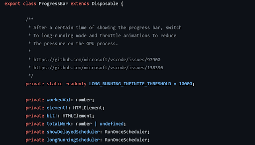

*Figure 21: Shows the ProgressBar object*

**Example 2**

Another example, similar to the ProgressBar, is the CountBadge class. This class too only has one responsibility, to display a count in a badge icon. This class can be used for several different reasons: counting errors in code, counting documents that have been changed, or counting the number of extensions in use to name a few. Yet, the class only performs one action. This class does not have other functionality within the file, so it is guaranteed that there is only one responsibility for this class.

**Code**

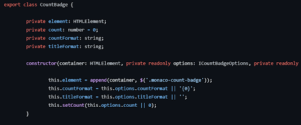

*Figure 22: Shows the CountBadge object*

## System Improvements

### Combining Functions

#### Height and Width
In the file [actionbar.ts](https://github.com/microsoft/vscode/blob/main/src/vs/base/browser/ui/actionbar/actionbar.ts), you can see two functions `getHeight()` and `getWidth()` located on lines 400-420. These functions were extremely similar, with one difference of getting the height from the item or getting the width.

 and getHeight() functions in the actionbar.ts file")

*Figure 23: The getWidth() and getHeight() functions in the actionbar.ts file*

Due to how similar they are, we created a new function getHeightorWidth. This new function performs very similarly to the previous two functions. We added a new input where the user can specify which length type they would like to receive. We accounted for users inputting a length type that was not height or width by returning a null value. We also appropriately named our function so the user would know exactly what the function was doing.

 function located in actionbar.ts file")

*Figure 24: The getHeightorWidth() function located in actionbar.ts file*

We changed this function in order to remove repetitive code within our program. This would solve the code smell of Duplicate Code. If the process of getting height or width changed, the programmers would now only have to change one function rather than two. This change is consistent with the Combine Functions refactoring process.

These functions are not exported outside of this file, and are defined within the file, so there is no need to change them elsewhere in the system. In other parts of the system you will find different `getHeight()` functions used in other files, but those are not joined with similar getWidth functions (and vice versa) like in actionbar.ts. Due to this fact, there is no need to refactor those functions as they are not duplicating code.

****

#### Show and Hide
In the file [dropdown.ts](https://github.com/microsoft/vscode/blob/main/src/vs/base/browser/ui/dropdown/dropdown.ts), there was a section where two functions were located: `show()` at line 108, and `hide()` at line 115. However, both functions were pretty similar as they were only checking whether or not the visibility was true or false, as shown below:

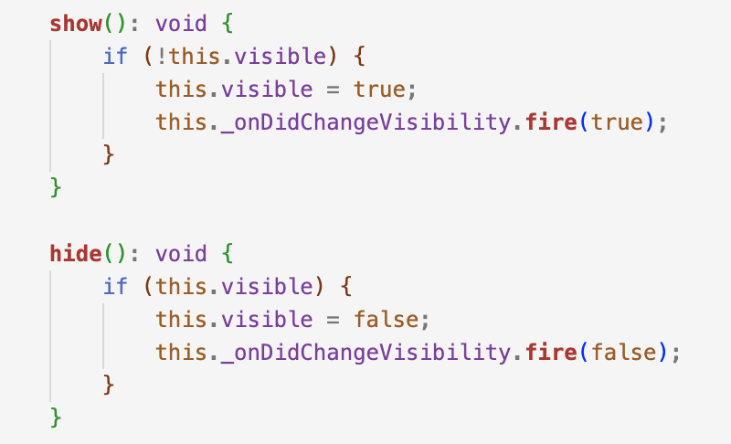

*Figure 25: The show() and hide() functions in the dropdown.ts file.*

However, these two functions could be combined into one to avoid code duplication and redundancy. To refactor this, we combined the two functions into one function as `showOrHide` that decides whether the dropdown is visible or not, shown as follows:

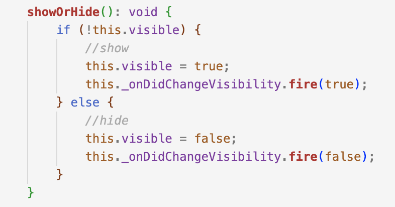

*Figure 26: Implementing a showOrHide() function in the dropdown.ts file to replace the functions show() and hide().*

Furthermore, the `show()` and `hide()` functions are located between lines 53 and 84, where the code checks once again whether `this.visible` is true or not, which is also redundant as `showOrHide` already checks for this condition.

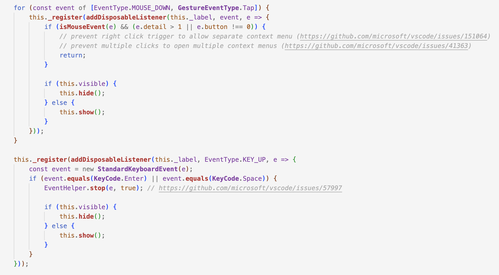

*Figure 27: The functions show() and hide() being called within a redundant if statement.*

Because our `showOrHide` function already checks for the conditional, we are able to get rid of the if statements located between lines 53 and 84 and just implement the `showOrHide()` function itself in the two instances it is being used.

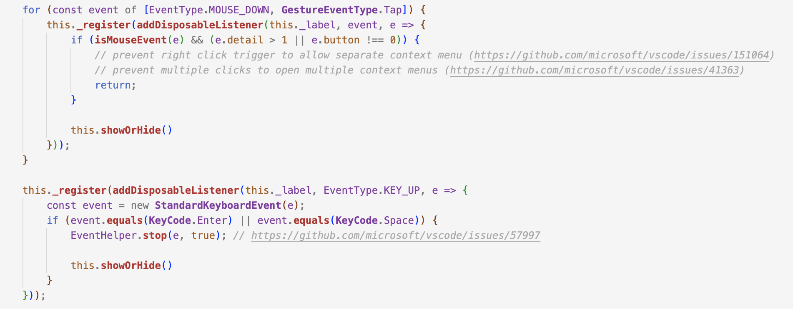

*Figure 28: The function showOrHide() replacing the if statements containing functions show() and hide().*

****

#### renderBadge

In the [countBadge.ts file](https://github.com/tiffanyhlc/vscode/blob/main/src/vs/base/browser/ui/countBadge/countBadge.ts), the class handles both logic and rendering in a single method, which violates the Single Responsibility Rule. The existing `render` method on line 58 handles multiple aspects, leading to duplication of the code, as follows:

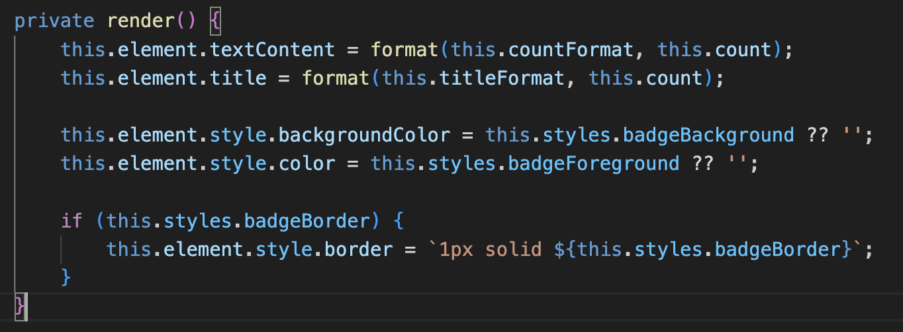

*Figure 29: The original function render() handling multiple aspects (count, title, and styles)*

To refactor, we can extract the method. Split the `render()` method into smaller, more focused methods, such as `renderCount`, `renderTitle`, and `renderStyles` to handle specific rendering tasks. To improve readability and signify the purpose, we can also rename the `render` method to `renderBadge`. The mentioned refactoring changes are as follows:

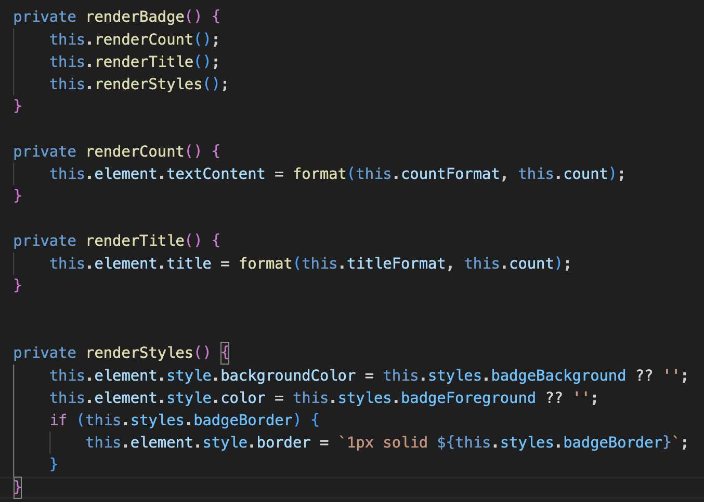

*Figure 30: The updated renderBadge() function includes the smaller of renderCount(), renderTitle(), and renderStyles().*

This refactoring aims to break down the monolithic `render()` method into smaller, more focused methods. Methods like `setCountFormat`, `setTitleFormat`, and `setCount` all perform different tasks but trigger the same `render()` method, indicating low method cohesion. By separating rendering concerns and improving encapsulation, the refactored code enhances readability and maintainability. These methods can now trigger more specific rendering methods directly.

By renaming the `render` method, we need to change the lines that call this to `renderBadge`. This will look like the following:

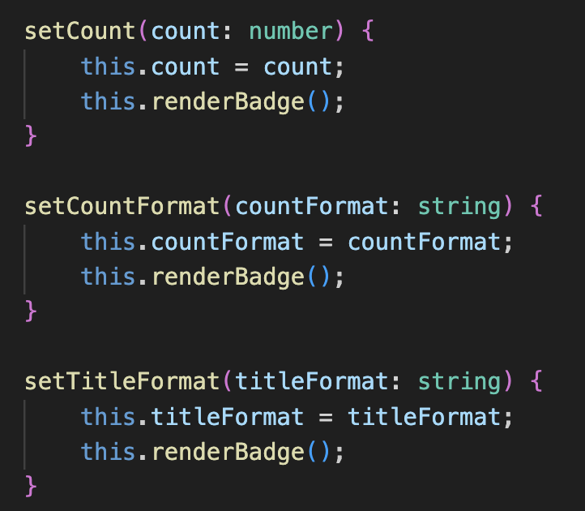

*Figure 31: Updated the call from render() to renderBadge() in the functions setCount, setCountFormat, and setTitleFormat*

****

### Encapsulation

Encapsulation functionality is a fundamental principle in software development. By exposing only the information that is required, encapsulation helps to conceal internal details.

In the main.js, encapsulating the ‘BrowserWindow’ creation logic into a function places the code responsible for creating a ‘BrowserWindow’ inside a separate function rather than having it directly in the event handler or where it is being used. The function contains all the information needed to create a BrowserWindow and the external code just needs to know how to call the function.

#### Without Encapsulation:
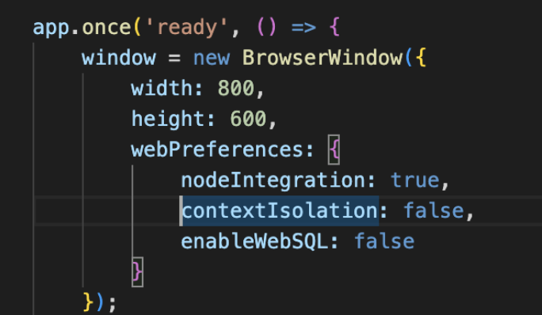

*Figure 32: Showing BrowserWindow without encapsulation*

#### With Encapsulation:
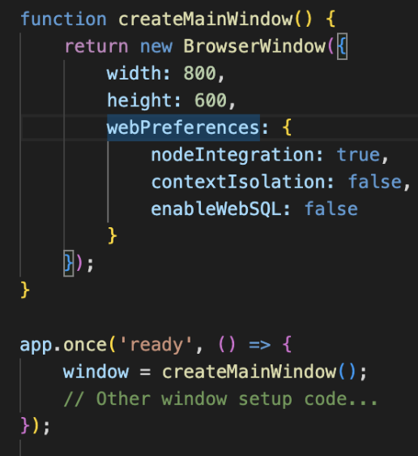

*Figure 33: Showing BrowserWindow with encapsulation*

In the after version, the logic of creating a ‘BrowserWindow’ is encapsulated in the ‘createMainwindow’ function. This enhances maintainability and modularity in the code. It is easier to manage and comprehend if we can modify the ‘BrowserWindow’ creation logic in a single, centralized location.

In order to facilitate comprehension for someone reading the code, the ‘createMainWindow’ function isolates the goals of creating a main window. If something changes with the logic for creating the window, all we have to do is update it once, inside the createMainWindow function, saving the trouble of searching through the entire codebase. The encapsulation helps in organizing the code better.  The general structure of the code is improved by the common practice of organizing related functionality into functions or classes. In the case that we need to add more windows or components later on, we can simply utilize the defined function ‘createMainWindow.’

### Running the Tests

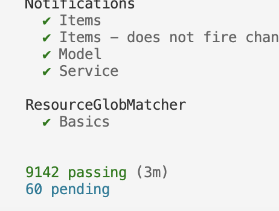

*Figure 34: Results of running the given VSCode test suite with 9142 passing and 60 pending tests*

After adding each of our changes to the forked repository, we ran all the tests to see if the system would work by running `./scripts/test.sh —run`. We resulted in a total of 9,142 tests that were able to pass, with a total of 60 pending tests.

VSCode uses a testing framework known as `mocha`. In our above image [Figure 34], you can see many pending tests. These tests are not failed tests, and can be there for a multitude of reasons. According to [mocha’s website](https://mochajs.org/#pending-tests), a pending test is a test-case “...without a callback”. These tests are skipped because they are in the process of being written, or they need to be done. In conclusion, they are not run with the other tests and in our project were not run with our changes.
